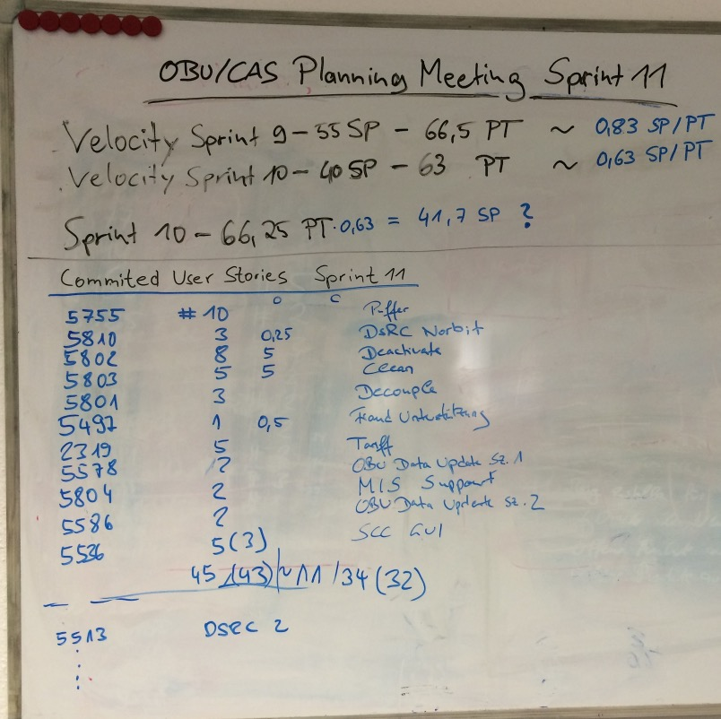

# Scrum Introduction

An introduction to Scrum for usage in [Fontys venlo](https://fontysvenlo.nl/de/) Software Engineering and Business Informatics study

<!-- s -->

## Topics

- What is Agile?
- What is Scrum?
- Why Scrum?
- Scrum Framework
- Teamwork: Roles in Scrum
- Meetings in Scrum
- User Stories
- Performance

<!-- s -->

## What is AGILE?

- Time focused<!-- .element: class="fragment" -->
- Iterative<!-- .element: class="fragment" -->
- Incremental product development<!-- .element: class="fragment" -->
- Deliver small pieces<!-- .element: class="fragment" -->
- Feedback<!-- .element: class="fragment" -->

<!-- n -->

What does it mean if somebody says, he works agile or uses an agile process?
**Time focused**, usually using Time Boxing: Do not exceed time given for meetings.
**Iterative**, doing the work in iterations, for instance, doing analysis, design, implementation and testing again and again.
**Incremental product development** means creating **small pieces** of functionality and thus
Developing these small pieces
The most important thing in agile is the **feedback part**. 

<!-- s -->

## Agile Manifesto 

- Individuals and interactions over processes and tools<!-- .element: class="fragment" -->
- Working software over comprehensive documentation<!-- .element: class="fragment" -->
- Customer collaboration over contract negotiation<!-- .element: class="fragment" -->
- Responding to change over following a plan<!-- .element: class="fragment" -->

<!-- n -->

So what all these agile processes have in common is that they follow the 12 principles of the agile manifesto. This manifesto was developed by some guys, e.g. Robert C. Martin (Uncle Bob), Ron Jeffries (Creator of Spring), Alistair Cockburn (Use Case Expert), Martin Fowler, Kent Beck, Ken Schwaber, Jeff Sutherland… asf.  

### Individuals and interactions over processes and tools

Individuals are more important than processes and tools. The people are doing the work.

### Working software over comprehensive documentation

This does not mean that documentation work should be skipped. It means that only the documentation which is necessary must and should be created. E.g. if 

### Customer collaboration over contract negotiation

Have the customer on-board. The customer should work with the team together instead of insisting on contractual parts which can and mainly will change. 

### Responding to change over following a plan

Be able to handle changes - better - embrace changes. Projects will change thus managing changes well means managing the project well. 

## 12 Principles

The 12 principles are based on the Agile Manifesto.

- 1  - Our highest priority is to satisfy the customer through early and continuous delivery of valuable software.

- 2 - Welcome changing requirements, even late in development. Agile processes harness change for the customer’s competitive advantage.

- 3 - Deliver working software frequently, from a couple of weeks to a couple of months, with a preference to the shorter timescale.

- 4 - Business people and developers must work together daily throughout the project.

- 5 - Build projects around motivated individuals. Give them the environment and support they need, and trust them to get the job done.

- 6 - The most efficient and effective method of conveying information to and within a development team is face-to-face conversation.

- 7 - Working software is the primary measure of progress.

- 8 - Agile processes promote sustainable development. The sponsors, developers, and users should be able to maintain a constant pace indefinitely.

- 9 - Continuous attention to technical excellence and good design enhances agility.

- 10 - Simplicity–the art of maximizing the amount of work not done–is essential.

- 11 - The best architectures, requirements, and designs emerge from self-organizing teams.

- 12 - At regular intervals, the team reflects on how to become more effective, then tunes and adjusts its behavior accordingly.

<!-- s -->

## What is Scrum?

<!-- .slide: data-background="https://media.giphy.com/media/reKoKNEqzn596/giphy.gif" -->

- Agile Managementframework<!-- .element: class="fragment" -->
  - Ken Schwaber<!-- .element: class="fragment" -->
  - Jeff Sutherland<!-- .element: class="fragment" -->
- Empirical process<!-- .element: class="fragment" -->
- Goal is to produce<!-- .element: class="fragment" -->
- Does NOT ensure success<!-- .element: class="fragment" -->
- Is hard work<!-- .element: class="fragment" -->
- http://www.scrumguides.org/<!-- .element: class="fragment" -->

<!-- s -->

## The Scrum Guide

<!-- .element: class="fragment" -->

<!-- s -->

- Self organized teams<!-- .element: class="fragment" -->
- Transparency<!-- .element: class="fragment" -->
- Continuous improvement (Inspect and Adapt)<!-- .element: class="fragment" -->
- Priorities set by business<!-- .element: class="fragment" -->
- Iterative steps (Sprints)<!-- .element: class="fragment" -->
- Requirements in backlog<!-- .element: class="fragment" -->
- No specific development method recommended<!-- .element: class="fragment" -->
- Few but strict rules<!-- .element: class="fragment" -->

<!-- s -->

<!-- s -->

 ## Agile/Scrum is NOT:

- “Just start to work”<!-- .element: class="fragment" -->
- Everybody can do what she/he wants<!-- .element: class="fragment" -->
- There are no rules<!-- .element: class="fragment" -->
- Nobody needs processes<!-- .element: class="fragment" -->
- Only programming - no planning - docs<!-- .element: class="fragment" -->

<!-- s -->

## Scrum project profile

<!-- n -->

There are different project types:

### Innovation

- Derivative, a derivate of a succesfull product
- Platform: a new version of an existing product with much market research needed etc.
- Breakthrough product: extremly challending, no real market yet exists. Customers need to experience your product. 

### Technology Level (technically difficult)

- Low-Tech: no rechnology risk as good known tech level
- Mid-Tech
- High-Tech: probably unclear requirements for a long time etc. 

### Complexity

- Assembly: Building straight-forward product
- System: Building ships, cars building or complex software programs. 
- Array: multiple systems, many stakeholders, high risk.

### Time pressure

- Regular: Normal time pressure level - if that can be said in a project. 
- Fast/Competitive: You need to be fast with your project to be competitive
- Time-Critical: Absolutely time crititcal, e.g. rules need to be implemented or a high penalty must be paid. 
- Blitz

<!-- s -->

# The Scrum roles

<!-- s -->

<!-- n -->

- Planning: 1w / 2h, 2w / 4h… max 8h
- Review: 1h for 1 week sprint  1w / 1h, 2w, 2h… max 4h
- Retrospective: 45m for 1 week sprint  1w / 45m, 2w / 1,5h... Max 3h

<!-- s -->

## Product Owner

- Product Backlog<!-- .element: class="fragment" -->
- Business Value<!-- .element: class="fragment" -->
- Contact person for team<!-- .element: class="fragment" -->

<!-- n -->

- The product owner is responsible for the product backlog - means makes sure it is up to date, that the product backlog items (usually User Stories) are estimated on time and that they are prioritized. Can and should ask for help of the team!
- He is the responsible person for the business value. Thus he is in charge - he answers questions regarding what feature to do next. He either can decide on his own or gets the answer from somewhere else. 
- Thus he is the contact person for the team regarding all questions. Of course he can delegate, but he is responsible!

<!-- s -->

## Development Team

- 3-9 people<!-- .element: class="fragment" -->
- Estimations<!-- .element: class="fragment" -->
- Delivers releasable increments<!-- .element: class="fragment" -->
- Interdisciplinary<!-- .element: class="fragment" -->
- Self organizing<!-- .element: class="fragment" -->

<!-- n -->

Usually a team consists of 3-9 people. Why? Well, more people, more communication effort. 
The team does the estimations and is doing the work thus after every sprint/iteration deliver an increment. 
The team should be able to do the whole work, meaning having an interdisciplilary team will empower the team to do all the work on its own. 
Nodoby tells the team exactly what and how to do the work. But, the product owner defines what should be done first - priorisation. 

<!-- s -->

## Scrum Master

- Ensures process<!-- .element: class="fragment" -->
- Helps removing impediments<!-- .element: class="fragment" -->
- Moderation<!-- .element: class="fragment" -->
- Coaching<!-- .element: class="fragment" -->

<!-- n -->

The Scrum Master is a coach of the team. With this role he not only ensures that the scrum process will be followed, but he will coach the team how to follow the process. This could mean general coaching on work, but maybe also lecturing for providing agile and scrum knowledge.
He will help removing impediments. This does not mean he will remove them in person, but supporting and finding solution for solving them. 
Usually a Scrum Master is not only a coach but normally experienced person in project environments. 

<!-- s -->

## Product Backlog

- list of everything ➡ for the product (Backlog Items)<!-- .element: class="fragment" -->
- single source of requirements<!-- .element: class="fragment" -->
- Product Owner is responsible<!-- .element: class="fragment" -->
- Product Owner manages Product Backlog<!-- .element: class="fragment" -->
- Product Owner puts new Backlog Items into Product Backlog<!-- .element: class="fragment" -->
- Order of Backlog Items in Product Backlog defines importance <!-- .element: class="fragment" -->
<!-- n -->

- Product Backlog is a list of everything which might be needed for the product (Backlog Items)
- Product Owner is responsible for maximizing the value of the product and the work of the Development team.
- Product Owner responsible for managing Product Backlog
- Product Backlog is the single source of requirements
- PO puts new Backlog Items into PB
- Order of PB in PO defines “importance” and thus steers which one to do next
- Product Backlog Items can be very coarses grained like:

>User Administration or Secure Server Connection 

or they can be very precise:

> As an administrator I want to have a user account blocked on fraud detection, so that this user is not able to use the services anymore. Testcase: When a new user is created AND the user triggers a fraud scenario THEN this user must be blocked in the backend and is not able to login again.

<!-- s -->

## Product backlog items as User Stories

### Short and simple description of features from the perspective of the user<!-- .element: class="fragment" -->

> As an Administrator, I want to check and confirm a new blog entry so that it is visible on my webpage.<!-- .element: class="fragment" -->

**Or**<!-- .element: class="fragment" -->

> An Administrator can check and confirm a new blog entry.<!-- .element: class="fragment" -->

<!-- s -->

 ## User Stories should follow INVEST acronym

- Independent<!-- .element: class="fragment" -->
- Negotiable<!-- .element: class="fragment" -->
- Valuable<!-- .element: class="fragment" -->
- Estimatable<!-- .element: class="fragment" -->
- Small<!-- .element: class="fragment" -->
- Testable<!-- .element: class="fragment" -->

### User Stories should contain Acceptance Criterias<!-- .element: class="fragment" -->

<!-- s -->

## Product Backlog example

<!-- s -->

# Scrum Meetings

<!-- s -->

## Sprint Planning Meeting

### Participants

- Scrum Master<!-- .element: class="fragment" -->
- Product Owner<!-- .element: class="fragment" -->
- Develoment Team<!-- .element: class="fragment" -->
- Timeboxed: Length roughly 2h per 1week sprint<!-- .element: class="fragment" -->

<!-- s -->

- Scrum Master teaches how to stay in timebox<!-- .element: class="fragment" -->
- Goals: <!-- .element: class="fragment" -->
  - Which work to complete in the next sprint<!-- .element: class="fragment" -->
  - and how?<!-- .element: class="fragment" -->
- Team decides based on capacity and velocity how much work can be done until end of next sprint<!-- .element: class="fragment" -->
- Outcome: Sprint Goal and Sprint Backlog<!-- .element: class="fragment" -->

<!-- s -->

## Estimations

- done in Planning Meeting<!-- .element: class="fragment" -->
- Estimate relatively e.g. <!-- .element: class="fragment" -->
  - Story Points<!-- .element: class="fragment" -->
  - T-Shirt Sizes<!-- .element: class="fragment" -->
- How? Playing Planning Poker<!-- .element: class="fragment" -->
- Fibonacci<!-- .element: class="fragment" -->

<!-- .element: class="fragment" -->

<!-- s -->

<!-- .element: class="fragment" -->

<!-- s -->

<!-- .slide: data-background="images/sprint-planning-2.jpg" -->

<!-- n -->

<!-- .element: class="fragment" -->

<!-- s -->

<!-- .slide: data-background="images/sprint-planning-3.jpg" -->

<!-- n -->

<!-- .element: class="fragment" -->

<!-- s -->

## Backlog example

<!-- .element: class="fragment" -->

<!-- s -->

## Sprint Backlog example

<!-- .element: class="fragment" -->

<!-- s -->

## Sprint and Daily Meetings

<!-- .element: class="fragment" -->

- Team doing the work in the Sprint<!-- .element: class="fragment" -->

<!-- s -->

### Daily Meeting

- Daily is NO Management reporting meeting!!!<!-- .element: class="fragment" -->
- Daily Meetings (15 min Timebox)<!-- .element: class="fragment" -->
  - What did I do/finish yesterday<!-- .element: class="fragment" -->
  - What will I do/finish today<!-- .element: class="fragment" -->
  - Issues? (Impediments)<!-- .element: class="fragment" -->
- No detailed discussions in daily<!-- .element: class="fragment" -->
- Getting the team informed about the progress<!-- .element: class="fragment" -->
- Team usually discusses after the meeting<!-- .element: class="fragment" -->

<!-- s -->

## Sprint Review Meeting

- Time boxed meeting (1h per 1 week) <!-- .element: class="fragment" -->
- Participants usually Development Team, Product Owner, Scrum Master and key stakeholder<!-- .element: class="fragment" -->
- Team demonstrates the results (Done User Stories)<!-- .element: class="fragment" -->
- Product Owner accepts or not accepts User Stories<!-- .element: class="fragment" -->
- Probably new Product Backlog Items occur<!-- .element: class="fragment" -->

<!-- s -->

## Sprint Review Meeting examples

<!-- .element: class="fragment" -->

<!-- s -->

### Another Sprint Review Example

<!-- .element: class="fragment" -->

<!-- s -->

### And another Sprint Review

<!-- .element: class="fragment" -->

<!-- s -->

## Definition of Done

- What means a User Story thus a feature is done?<!-- .element: class="fragment" -->
- First of all a User Story is functionally done if the Product Owner is “happy” ➡ Acceptance Criteria<!-- .element: class="fragment" -->
- What about the quality?<!-- .element: class="fragment" -->

*Scrum does not allow negotiation according to quality.*<!-- .element: class="fragment" -->

<!-- s -->

### Setup a Definition of Done - Example

- Code must be Unit tested. Tests GREEN ✅<!-- .element: class="fragment" -->
- Code must be checked in into Version Control System ✅<!-- .element: class="fragment" -->
- Successful Automated build, all tests GREEN ✅<!-- .element: class="fragment" -->
- Code and/or Spec-Review successfully done (or Pair programming) ✅<!-- .element: class="fragment" -->
- Code Coverage >= 85% ✅ 💯<!-- .element: class="fragment" -->
- Installation manual created/updated (if applicable) ✅<!-- .element: class="fragment" -->
- Administration manual created/updated (if applicable) ✅ 📔<!-- .element: class="fragment" -->
- Acceptance test done (Demo for Product Owner) without errors ✅ 🙍<!-- .element: class="fragment" -->
- Demo done on Integration Environment (not on DEV-machine) ✅ 💻<!-- .element: class="fragment" -->
- ...<!-- .element: class="fragment" -->

<!-- s -->

## Sprint Retrospective

- Most important Meeting<!-- .element: class="fragment" -->
- What went wrong / what went well regarding process / work / people / tools<!-- .element: class="fragment" -->
- Inspect and Adapt<!-- .element: class="fragment" -->
- Plan improvements (actions)<!-- .element: class="fragment" -->
- Scrum Master moderates<!-- .element: class="fragment" -->

<!-- s -->

### Retro example

<!-- .element: class="fragment" -->

<!-- s -->

### Another retro example

<!-- .element: class="fragment" -->

<!-- s -->

### Again a retro example

<!-- .element: class="fragment" -->

<!-- s -->

## Burndown Chart

<!-- s -->

## How to estimate?

<!-- s -->

## How to start?

<!-- s -->

## Schedule

- Week 7: 
- Week 8: 
- Week 9: 
- Week 10: 
- Week 11: 
- Week 12: 
- Week 13: 
- Week 14: 

<!-- s -->

## What to do today and project week(s)

- Setup your scrum process and your project
- Check the scrum roles and decide who should take the role(s)
- How and where do we manage our work items? (Use Cases, User Stories, Epics, Features, Ideas...)
  - In a backlog?
  - Trello? Github project board? Github Zenhub? Jira? ...
- When, where and how will you hold your daily?

<!-- s -->

## Hints for starting

- Start with a high level SRS
  - Why?
    - You need to have an idea about the high level functionalities and architecture
    - You need to fill your backlog!!! (items, stories, epics, features ... you want to work on)
    
## Example setup

...

## Additional information and material

### Scrum taken serious

### Books

