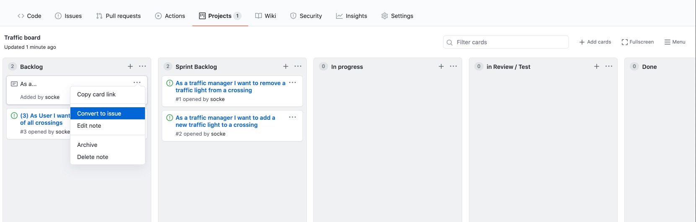
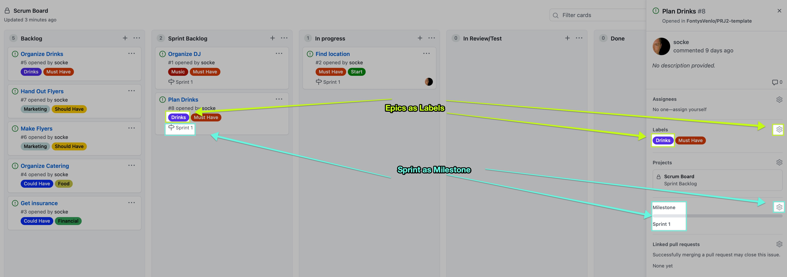
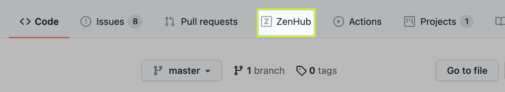
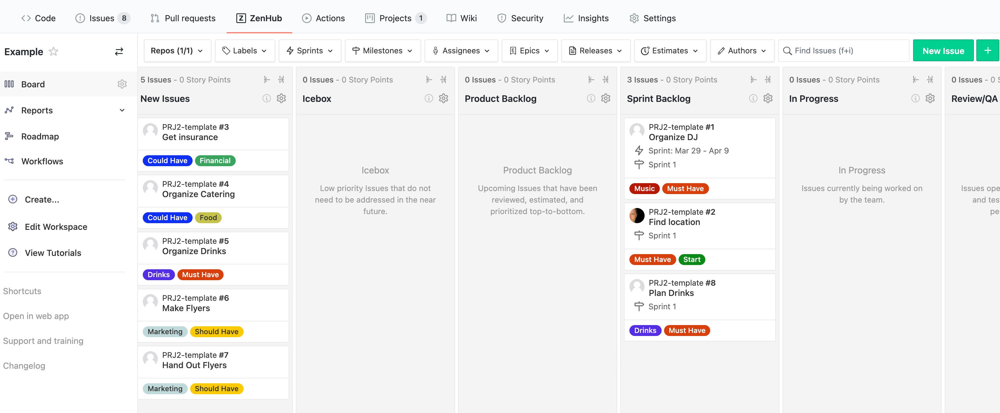
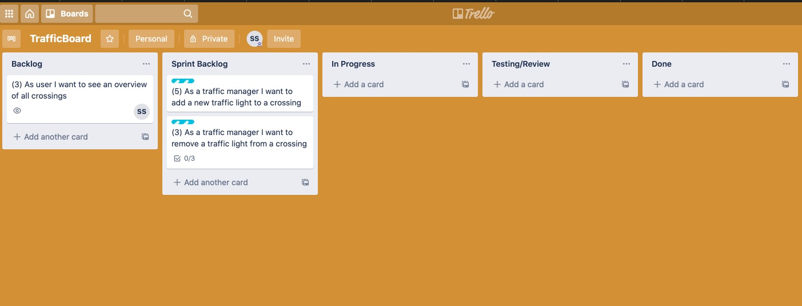

# Scrum - How to start?

<!-- .slide: data-background="https://media.giphy.com/media/Ln2dAW9oycjgmTpjX9/giphy.gif" -->

<!-- s -->

## What to do today and project week(s)

- Setup your scrum process and your project<!-- .element: class="fragment" -->
- Check the scrum roles and decide who should take the role(s)<!-- .element: class="fragment" -->
- How and where do we manage our work items? (Use Cases, User Stories, Epics, Features, Ideas...)<!-- .element: class="fragment" -->
  - In a backlog?<!-- .element: class="fragment" -->
  - Github project board? Github Zenhub? Trello? Jira? ...<!-- .element: class="fragment" -->
- When, where and how will you hold your daily?<!-- .element: class="fragment" -->

<!-- s -->

## Example setup

### Github project

<!-- .element: class="fragment" -->

<!-- n -->

- Create a github project board. The advantage is, that this is directly in your github repository. 
- Hint: convert "notes" to "issues" - then you can refer to these issues in your commits with the issue number: #1 #2 #3...

<!-- s -->

#### Easy setup: Use labels for EPICS 

- Why?<!-- .element: class="fragment" -->
- You have a huge Use Case / Work Item<!-- .element: class="fragment" -->
- Make a label for this huge item<!-- .element: class="fragment" -->
- Assign the items which belong to that to that label<!-- .element: class="fragment" -->

<!-- s -->

<!-- s -->

### Advanced Setup: Zenhub

- Chrome Plugin<!-- .element: class="fragment" -->
- We have a license so you can use that<!-- .element: class="fragment" -->
- Provides "Scrum" features via plugin<!-- .element: class="fragment" -->

[➡ ZenHub - Agile Project Management for GitHub](https://www.zenhub.com/)<!-- .element: class="fragment" -->

<!-- s -->

### Activate Zenhub on Github

Is only available if you have Chrome and installed plugin ❗<!-- .element: class="fragment" -->

<!-- .element: class="fragment" -->

<!-- s -->

### Example Zenhub board

<!-- s -->

### Trello

<!-- .element: class="fragment" -->

<!-- s -->

<!-- .slide: data-background="images/musk-better.jpg" -->